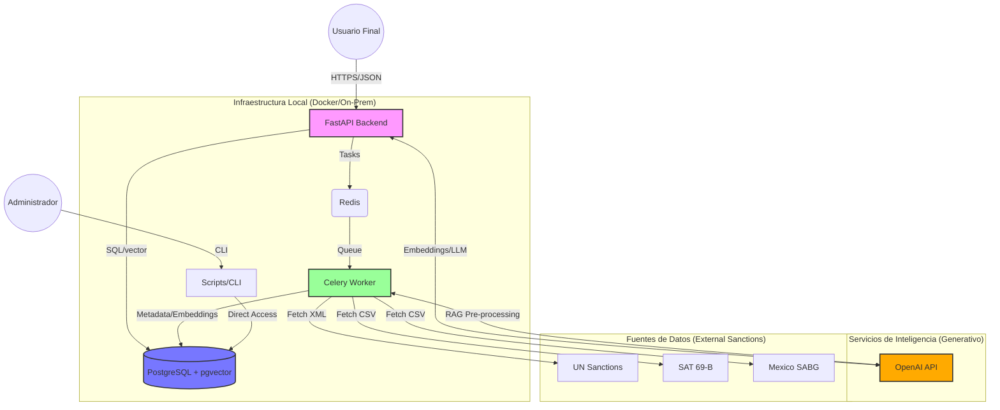
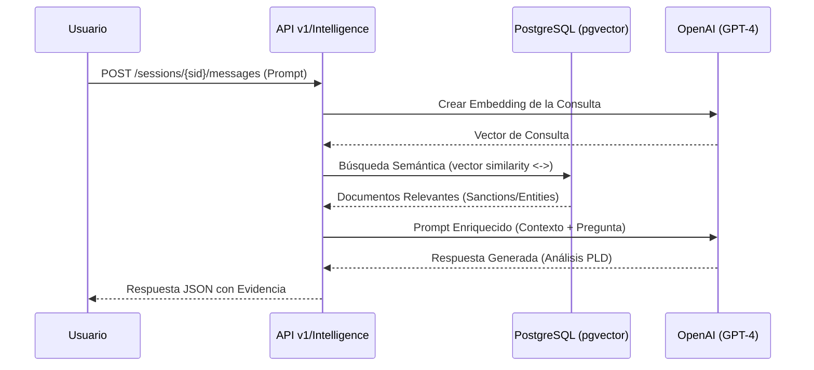

# Arquitectura del Sistema: Diagram-as-Code (DaC)

Este documento implementa el paradigma de **Diagram-as-Code (DaC)** para el backend de PLD-FT, garantizando que la documentación visual sea versionable y se mantenga sincronizada con el código fuente.

---

## 1. Diagrama de Contenedores y Flujos (Mermaid)

Este diagrama representa cómo interactúan los componentes principales del backend con los usuarios, la base de datos y los servicios externos de Inteligencia Artificial y listas de sanciones.



---

## 2. Flujo de Procesamiento RAG (Retrieval-Augmented Generation)

Visualización del proceso de búsqueda semántica y enriquecimiento de inteligencia para el análisis de entidades.



---

## 3. Estrategia de Implementación DaC con Python

Siguiendo la guía técnica redactada, el proyecto adopta las siguientes herramientas para la automación de diagramas:

1.  **Diagrams (Python Library):** Utilizada para generar diagramas de infraestructura de alto nivel mediante código Python.
    - Script: `scripts/generate_architecture.py`
    - Requerimientos: `pip install diagrams` y `graphviz` instalado en el sistema.
2.  **Mermaid.js:** Integrado directamente en este documento Markdown para visualización rápida en plataformas como GitHub/GitLab sin dependencias externas.
3.  **Docker-Compose-Diagram:** Recomendado para visualizar automáticamente la topología de contenedores a partir de `docker-compose.yml`.

---

## 4. Generación Programática con "Diagrams"

Para generar el diagrama de infraestructura oficial dentro del contenedor:

**IMPORTANTE:** Si recibes un error de `Permission denied: '/nonexistent'`, es necesario recrear el contenedor primero para aplicar el fix del `Dockerfile` (que crea un $HOME válido):

```bash
docker-compose up --build -d
```

Una vez reconstruido:

```bash
# 1. Instalar dependencias de Python necesarias (vía --user por seguridad)
docker-compose exec backend pip install --user diagrams graphviz mermaid-py

# 2. Ejecutar el script generador
docker-compose exec backend python scripts/generate_architecture.py
```

*Nota:* He actualizado el [Dockerfile](/home/drachenbc/programacion/TEZCA-LABS/PLD-FT-BACKEND/Dockerfile) para incluir el binario de los servicios de sistema (`graphviz`) y configurar una ruta de usuario persistente (`/home/appuser`).

---

## 5. Análisis de Mitigación de Entropía Documental

Siguiendo el informe técnico, la implementación de este ecosistema en **PLD-FT-BACKEND** aborda los siguientes puntos críticos:

### A. Sincronización con el Ciclo de Vida (CI/CD)
Al definir la infraestructura en Python (`scripts/generate_architecture.py`), el diagrama se convierte en un artefacto que se valida y actualiza en cada **Pull Request**. Los cambios en el `docker-compose.yml` deben reflejarse en el script de diagramas para que la documentación nunca quede obsoleta ("doc-rot").

### B. Mapeo del Ecosistema Docker
El uso de `docker-compose-diagram` permite extraer la topología real declarada para los servicios `db`, `redis`, `backend` y `worker`, visualizando puertos y dependencias de red de forma automática.

### C. Visualización de Inteligencia (RAG)
Dada la complejidad del módulo RAG (`app/services/intelligence_service.py`), el uso de **Mermaid** permite documentar los flujos de secuencia que involucran a `pgvector` y `OpenAI` detallando la latencia y la procedencia de datos (Groundedness), lo cual es vital para el cumplimiento regulatorio (Explainability).

### D. Modelo C4 para Auditoría
Para los stakeholders de cumplimiento (compliance), se recomienda el uso de **Buildzr** para generar vistas de Contexto que muestren cómo el sistema se integra legalmente con las listas de la ONU y el SAT, eliminando el ruido técnico innecesario para estas áreas mediante una abstracción de alto nivel.
